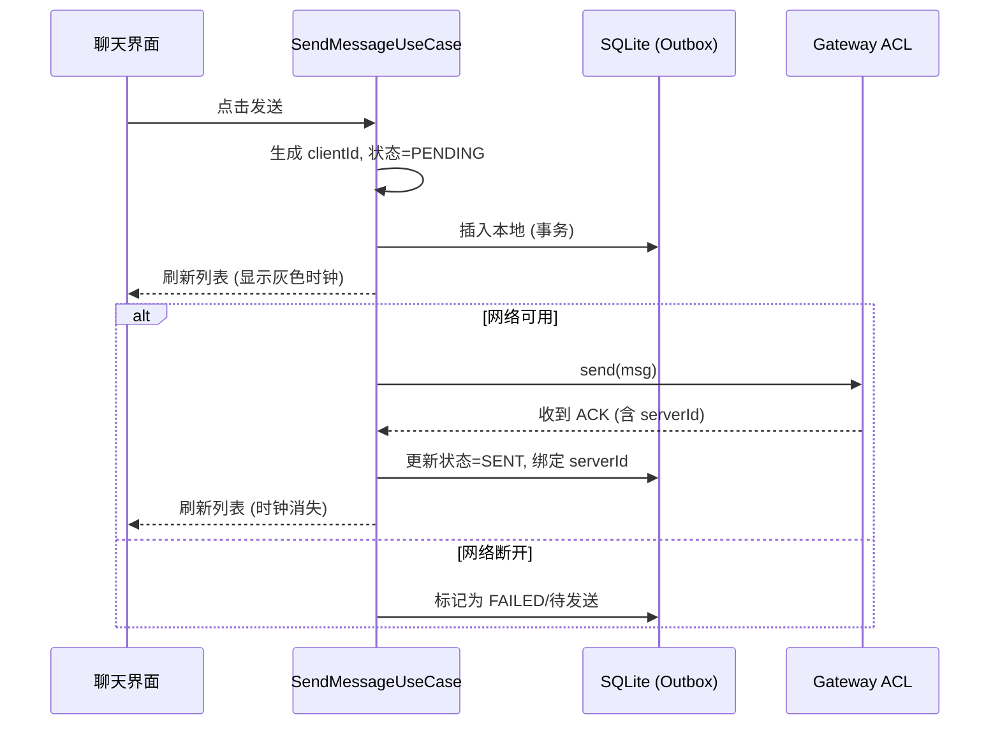
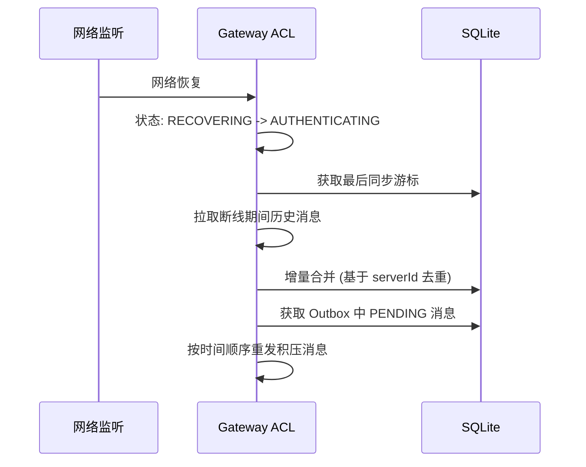

---

# ClawHub (ClawHub) 软件架构设计文档 vFinal (全景实施终版)

## 1. 架构核心原则
1. **单一数据源 (SSOT)**：所有 UI 状态必须由 Domain 层的 `StateFlow/Stream` 驱动，严禁在 ViewModel 或 UI 层维护临时状态变量或直接读取底层连接状态。
2. **防腐与契约驱动 (ACL)**：业务层绝对禁止直接依赖 OpenClaw 原生 JSON 或第三方 WS 库，必须通过 ACL 层定义的接口契约交互。
3. **离线优先与最终一致性**：UI 永远优先渲染本地 SQLite，通过双 ID 机制（ClientID/ServerID）和逻辑时钟保证多端数据最终一致。
4. **防御性降级**：对 Markdown 渲染、代码高亮、大文件传输设定严格的**性能红线与内存熔断机制**，确保极端数据下 App 绝不 OOM 崩溃。

---

## 2. 技术栈选型 (基于 Flutter 生态)

| 模块 | 推荐技术/库 | 选型理由与架构约束 |
| :--- | :--- | :--- |
| **UI 框架** | Flutter 3.x (Dart) | 自绘引擎保证双端 60fps 和 UI 绝对一致，Isolate 完美支持后台解析。 |
| **状态管理** | `Riverpod` | 支持依赖注入、响应式流（Stream/StateNotifier），完美契合 SSOT 规范。 |
| **本地数据库** | `drift` (SQLite) | 类型安全的 SQL 编写，**原生支持 FTS5 (全文搜索)**，支持事务与触发器。 |
| **数据库加密** | `sqlcipher` | 满足 PRD 安全需求，对 SQLite 进行整库加密，防止设备丢失后聊天记录泄露。 |
| **安全存储** | `flutter_secure_storage` | 底层调用 iOS Keychain / Android Keystore，仅存储 Token 引用。 |
| **网络通信** | `web_socket_channel` + `dio` | 结合自定义 ConnectionManager 实现心跳、指数退避重连。 |
| **Markdown** | `flutter_markdown` + `highlight` | 支持代码高亮，需通过自定义 Builder 拦截代码块和工具调用卡片。 |
| **路由导航** | `go_router` | 支持深度链接（Deep Link）和智能返回栈（SourceTag 路由表）。 |
| **硬件调用** | `mobile_scanner`, `local_auth` | 扫码解析与生物识别门禁。 |
| **网络监听** | `connectivity_plus` | 监听 WiFi/4G 切换，触发内网实例降级逻辑。 |

---

## 3. 系统逻辑架构 (分层设计)

```text
┌─────────────────────────────────────────────────────────────────┐
│ 1. Presentation Layer (展现层)                                  │
│  - UI Components (动态主题, 代码块Widget, 快捷指令栏, 错误边界) │
│  - ViewModels (状态聚合, 智能返回栈, 附属状态)                  │
│  - A11y & i18n (无障碍标签拦截器, 多语言资源字典)                │
├─────────────────────────────────────────────────────────────────┤
│ 2. Domain Layer (领域层 - 纯逻辑，无外部依赖)                   │
│  - UseCases (SendMessage, SyncConversations, HealthCheck)       │
│  - Entities (Instance, Agent, Message, Conversation, ToolCall)  │
│  - Analytics Events (定义埋点契约)                              │
├─────────────────────────────────────────────────────────────────┤
│ 3. Data Layer (数据层 - 实现领域层契约)                         │
│  - ACL: Gateway 协议适配、版本路由、Mock 实现                   │
│  - Repositories (事务管理, 消息预览生成, 锚点查询)              │
│  - Local Data Source (SQLite+FTS5, LRU Cache, Keychain, 埋点表) │
│  - Remote Data Source (WS Pool, Push Engine, 网络状态监听器)    │
├─────────────────────────────────────────────────────────────────┤
│ 4. Infrastructure (基础设施层)                                  │
│  - AOP Tracker (切面埋点), Logger, Migration Manager            │
└─────────────────────────────────────────────────────────────────┘
```

---

## 4. 核心领域模型 (Domain Entities)

```text
Entity Instance:
  id: UUID
  name: String
  gatewayUrl: String
  tokenRef: String // Keychain 引用 ID
  healthStatus: Enum(ONLINE, OFFLINE, CONNECTING, EXPECTED_OFFLINE)
  isLocalNetwork: Boolean // 标识是否为内网IP实例 (正则预判)

Entity Conversation (聚合根):
  id: String // 复合键：hash(instanceId + agentId)，确保全局绝对唯一
  agentId: String
  instanceId: UUID
  lastMessagePreview: String // 由预览生成引擎计算
  unreadCount: Integer
  
Entity Message:
  clientId: UUID // 本地生成，用于发送和去重兜底
  serverId: String // Gateway 分配，用于全局去重
  conversationId: UUID
  status: Enum(DRAFT, PENDING, SENDING, SENT, DELIVERED, FAILED, EXPIRED)
  logicalClock: Integer // 逻辑时钟，解决同秒消息排序
  // ...其他基础字段
  
Entity ToolCall (子实体):
  id: UUID
  messageId: UUID 
  toolName: String
  status: Enum(PENDING, RUNNING, SUCCESS, FAILED)
  
Entity QuickCommand:
  id: UUID
  agentId: String
  label: String // 展示名称
  payload: String // 实际发送文本
```

---

## 5. 关键子系统详细设计

### 5.1 网关防腐层 (ACL) 与连接状态机
* **接口契约**：业务层只依赖 `IGatewayClient` 接口（`connect`, `send`, `fetchHistory`）。
* **状态机**：`DISCONNECTED` -> `CONNECTING` -> `AUTHENTICATING` (Token+设备ID+配对码) -> `CONNECTED` -> `RECOVERING`（断线重连中，暂停业务发送，Outbox积压） -> `AUTH_FAILED`（认证失败需重新扫码）。
* **安全拦截**：ACL 入口强制校验 `wss://`，生产环境拦截 `ws://` 抛出 `InsecureConnectionException`。

### 5.2 消息中心聚合与预览生成引擎
* **事务包裹**：收到新消息时，在同一个 SQLite 事务内插入 `Message` 并更新 `Conversation` 的 `lastMessageId` 和 `unreadCount`。
* **预览纯函数**：
  ```text
  func GeneratePreview(msg):
    prefix = (msg.role == USER) ? "你: " : ""
    switch msg.type:
      case TEXT: return prefix + truncate(stripMarkdown(msg.content), 40)
      case IMAGE: return prefix + "[图片]"
      case FILE:  return prefix + "[文件]"
      case TOOL_CALL: return prefix + "[工具调用]"
  ```

### 5.3 消息生命周期与本地淘汰 (1000条红线)

**Message 状态机（7 状态完整版）**：
`Message.status` 必须包含以下完整枚举，UI 根据状态渲染不同图标（时钟、勾、红叹号）：

| 状态 | 含义 | UI 渲染 |
| :--- | :--- | :--- |
| `DRAFT` | 草稿：用户正在输入框编辑，尚未点击发送 | 输入框草稿标记，不入列表 |
| `PENDING` | 在 Outbox：已点击发送，写入本地数据库，等待网络可用 | 列表显示**灰色时钟** |
| `SENDING` | 发送中：网络可用，已通过 WebSocket 发出，等待 Gateway ACK | 列表显示**转圈/发送中** |
| `SENT` | 已送达网关：收到 Gateway ACK，serverId 已绑定 | 列表显示**单勾** |
| `DELIVERED` | Agent 已读/处理：Gateway 回执确认 Agent 已接收 | 列表显示**双勾** |
| `FAILED` | 发送失败：网络超时或 Gateway 拒绝，可点击重试 | 列表显示**红色叹号** |
| `EXPIRED` | 超时放弃：超过最大重试次数（如 3 次）或 24 小时未成功 | 列表显示**灰色过期标记**，不可重试 |

**状态流转**：
```
DRAFT --(点击发送)--> PENDING --(网络可用)--> SENDING --(收到ACK)--> SENT --(Agent回执)--> DELIVERED
   |                      |                    |                    |
   |                      |                    |--(超时无ACK)--> FAILED --(重试)--> SENDING
   |                      |                    |                    |
   |                      |                    |--(重试3次失败)--> EXPIRED
   |                      |--(网络不可用)--> FAILED --(网络恢复)--> SENDING
   |--(放弃编辑)--> 删除
```

**SQLite 触发器自动淘汰**：
```sql
CREATE TRIGGER trg_message_limit AFTER INSERT ON messages
WHEN (SELECT count(*) FROM messages WHERE agent_id = NEW.agent_id) > 1000
BEGIN
    DELETE FROM messages WHERE agent_id = NEW.agent_id 
    AND id NOT IN (SELECT id FROM messages WHERE agent_id = NEW.agent_id ORDER BY timestamp DESC LIMIT 1000);
END;
```

### 5.4 全局搜索与"锚点定位" (Anchor Loading)
* **搜索**：基于 SQLite FTS5 虚拟表，支持中英文分词与高亮 snippet。
* **锚点定位**：点击搜索结果跳转时，ViewModel 执行**窗口查询**（以 target 为中心，向上取 5 条，向下取 10 条），喂给虚拟列表后调用 `scrollToIndex` 精准定位。

### 5.5 代码块独立渲染与 OOM 熔断
* **AST 抽离**：Markdown 解析器遇到 ```` ``` ```` 节点时，生成 `CodeBlockNode`，交由独立的 `CodeBlockWidget` 渲染。
* **CodeBlockWidget 详细规范**：
  * 外层：限制最大宽度，支持**横向滚动**（防止长代码撑破气泡）。
  * 头部：右上角显示语言标签（如 `python`）和**复制按钮**。
  * 内容：集成 `highlight.js` (或原生 SyntaxHighlighter) 进行语法高亮。
* **性能红线**：Widget 强制 `maxHeight = 300dp`，超出内部滚动。若 `highlight` 引擎抛出 OOM，外层 `ErrorBoundary` 捕获并**瞬间降级为灰底等宽纯文本**。

### 5.6 网络环境感知与内网降级
* **监听器**：监听系统网络变化。当 WiFi 切 4G 时，遍历所有 `isLocalNetwork = true` (如 192.168.x.x) 的实例，批量标记为 `EXPECTED_OFFLINE`，UI 弹出 Banner 并禁用发送按钮，避免无效重连报错。切回 WiFi 时触发静默 HealthCheck。

### 5.7 快捷指令与动态主题
* **快捷指令**：`ChatRoomViewModel` 监听当前 Agent 的指令列表，渲染于输入框上方。在虾详情页修改后，通过 EventBus 通知 ChatRoom 热更新。
* **动态主题**：根据 `Agent.themeColor` 生成 Material Color。若系统为深色模式且主题色过暗，自动提亮 HSL 明度以满足 **WCAG 2.1 AA 级对比度标准**（对比度 > 4.5:1）。

### 5.8 智能返回栈 (Smart Back Stack)
**解决痛点**：从不同 Tab 进入对话，返回逻辑不同。
**架构解法**：Router 携带 `SourceTag` 参数。
```text
// 进入对话页
Router.push(ChatRoomPage, params: {agentId: "123", source: "MESSAGE_HUB"})

// 对话页返回逻辑
func ChatRoom_OnBack():
  source = Router.getParams().source
  if source == "MESSAGE_HUB":
     Router.popTo(MessageHubTab)
  else if source == "NOTIFICATION":
     Router.popToRoot() // 通知点击进入，返回主页
  else:
     Router.pop() // 默认返回虾列表
```

### 5.9 推送通知与后台保活引擎
**解决痛点**：系统级推送、免打扰、iOS 后台限制。
**架构解法**：构建 `NotificationDispatcher` 统一调度本地与远程推送。
* **本地推送 (前台/后台存活时)**：WebSocket 收到消息 -> 判断免打扰时段 -> 调用系统 Local Notification API。
* **远程推送 (iOS 后台被杀时)**：依赖 Gateway 侧接入 APNs/FCM。App 收到静默推送 (Silent Push) -> 唤醒 App 30秒 -> 触发 `SyncEngine` 拉取增量消息 -> 生成本地通知展示给用户。
* **免打扰引擎**：
  ```text
  func Dispatcher_Dispatch(notification):
    if Time.now() in DND_PERIOD (22:00-08:00):
       DB.insertIntoQueue(notification) // 存入静默队列
    else:
       System.showNotification(notification)
       
  // 定时器：每天 08:00 触发
  func OnDNDEnd():
    queued = DB.getQueuedNotifications()
    System.showSummaryNotification("您有 {count} 条虾消息待处理")
  ```

### 5.10 生物识别状态机
* **触发**：App 从后台切前台（超过设定时间）或冷启动。
* **流程**：弹出系统 FaceID/指纹 -> 成功则放行 Router；失败 1 次提示重试；失败 3 次**降级为 PIN 码输入**；系统不支持生物识别则直接降级为 PIN 码。

### 5.11 权限请求策略 (防拒访)
* **延迟请求**：App 首次启动**不弹窗**请求通知权限。
* **场景触发**：当用户首次开启"通知设置"开关，或首次收到长任务完成提示时，再触发系统权限弹窗。
* **被拒引导**：若用户拒绝，在"设置 -> 通知"页面展示黄色警告卡片，提供按钮直接 `DeepLink` 跳转至系统 App 设置页。

### 5.12 大文件分片传输
WebSocket 发送文件时，按 **64KB/片** 切割。
* 发送端：维护分片队列，每发一片等待 Gateway 返回 `ACK(fragment_id)`。
* 超时重传：单片 5 秒无 ACK 则重传，最多重试 3 次，失败则整个文件标记 `FAILED`。

---

## 6. 核心业务时序图

### 6.1 消息发送、Outbox 暂存与渲染闭环


### 6.2 断线重连与历史补偿


---

## 7. Mock 服务与测试策略

### 7.1 Mock 服务架构 (Gateway Simulator)
在 `core/acl/` 下实现 `MockGatewayClient`，实现与真实 ACL 相同的接口契约。
* **配置切换**：在 App 的"开发者设置"中提供一键切换 `Real / Mock` 环境的开关。
* **模拟行为**：
  * **握手与认证**：模拟 500ms 延迟，支持模拟 `Token 错误` 以测试认证失败 UI。
  * **Agent 列表**：从本地 `assets/mock/agents.json` 读取预设的 5 只虾（包含代码虾、产品虾等）。
  * **消息流模拟**：收到用户消息后，延迟 1-3 秒返回 Markdown 文本；随机触发 `ToolCall` 事件（进行中 -> 完成），以测试工具调用卡片的实时渲染。
  * **弱网模拟**：提供"模拟断网"和"模拟丢包"按钮，验证 Outbox 队列和重连机制。

### 7.2 测试策略矩阵
| 测试类型 | 覆盖范围 | 工具/框架 | 核心验证点 |
| :--- | :--- | :--- | :--- |
| **单元测试 (Unit)** | Domain 层 UseCase、Repository 纯函数 | `flutter_test`, `mocktail` | 消息预览生成规则、锚点查询 SQL 逻辑、状态机流转、双 ID 去重逻辑。 |
| **Widget 测试 (UI)** | 独立 UI 组件 | `flutter_test` | CodeBlockWidget 限高与降级、快捷指令栏渲染、空状态组件、红叹号/时钟图标展示。 |
| **集成测试 (E2E)** | 核心业务链路 | `integration_test` | 扫码添加实例 -> 发送消息 -> 断网 -> 重连同步 -> 验证消息不丢失且顺序正确。 |
| **性能测试 (Perf)** | 内存与帧率 | Flutter DevTools | 注入 1000 条包含巨型代码块的消息，验证列表滚动 60fps，内存不突破 150MB 红线。 |

---

## 8. 代码规范与工程约束

### 8.1 架构边界铁律 (Code Review 标准)
1. **禁止越级调用**：UI 层 (Widget) 严禁直接 import `drift` 数据库类或 `web_socket_channel`。必须通过 ViewModel 调用 UseCase。
2. **SSOT 规范**：严禁在 UI 层写 `if (ws.isConnected)` 或定时器轮询状态。所有网络状态、在线状态必须订阅 Domain 层提供的 `StateStream`。
3. **事务完整性**：任何涉及 `Message` 和 `Conversation` 同时更新的操作，必须在 Repository 层使用 `DB.transaction()` 包裹，防止数据不一致。
4. **单向数据流**：User Action -> 触发 UseCase -> 修改 Repository/DB -> 发射 StateFlow -> UI 订阅并渲染。任何绕过 UseCase 直接修改 UI 状态的行为，在 Code Review 时一律打回。

### 8.2 命名与目录规范 (完整版)

采用 **Feature-based (按功能特性)** 划分目录，这样在单人开发时，修改一个功能不需要在十几个文件夹间反复横跳：

```text
src/
├── core/                 # 核心基础设施 (与业务无关)
│   ├── acl/              # 防腐层：Gateway 协议适配、版本路由、Mock 实现
│   ├── network/          # WebSocket 客户端, 连接池, 重连策略, 分片传输器
│   ├── database/         # SQLite 封装 (drift), FTS5 配置, 迁移脚本
│   ├── security/         # Keychain/Keystore 封装, 生物识别状态机, 加密算法
│   ├── analytics/        # AOP 拦截器、本地事件存储、Opt-in 管理
│   ├── localization/     # I18n 引擎、多语言资源字典 (zh-CN.json, en.json)
│   └── monitor/          # 性能监控、内存水位、FPS 检测、降级策略
│
├── domain/               # 领域层 (纯逻辑，无外部依赖)
│   ├── models/           # Instance, Agent, Message, Conversation, ToolCall, QuickCommand 实体
│   ├── repositories/     # 接口定义 (IInstanceRepo, IMessageRepo, IConversationRepo)
│   └── usecases/         # 业务用例 (SendMessage, SyncConversations, GlobalSearch, HealthCheck)
│
├── data/                 # 数据层 (实现领域层契约)
│   ├── repositories/     # 协调 Local 和 Remote 的具体实现 (含事务管理、消息预览生成、锚点查询)
│   ├── local/            # SQLite 实现, DAO 层, LRU Disk Cache
│   └── remote/           # Gateway API 实现, WebSocket 消息解析, 推送引擎, 扫码解析器
│
├── features/             # 展现层 (按原型 Tab 和页面划分)
│   ├── instance_manager/ # 实例管理 (扫码, 表单, 列表, 内网IP正则校验)
│   ├── agent_list/       # 虾列表 (分组视图, 扁平视图切换, 状态统计栏)
│   ├── chat_room/        # 对话页 (Markdown渲染, 工具卡片, 输入栏, 快捷指令栏, CodeBlockWidget)
│   ├── message_hub/      # 消息页 (Conversation 聚合视图, 未读角标, 智能返回栈)
│   └── agent_profile/   # 虾详情 (成长面板, 成就, 个性化配置, 快捷指令 CRUD)
│
├── ui_kit/               # 【全局 UI 组件库】跨 Feature 复用的通用组件
│   ├── a11y/             # 无障碍标签包装器 (Semantic 封装)
│   ├── empty_states/     # 全局空状态/错误边界组件 (ErrorBoundary, EmptyState, LoadingSkeleton)
│   └── theme/            # 动态调色板算法, Material Color 生成, 深色模式适配
│
└── app/                  # 应用入口与全局配置
    ├── router/           # 全局路由配置, 深度链接处理, 智能返回栈 (SourceTag 路由表)
    ├── theme/            # 全局主题色, 字体, 12种虾主题色定义
    ├── di/               # 依赖注入配置 (Riverpod Provider 初始化)
    └── main.ext          # 程序入口, 延迟权限初始化
```

### 8.3 Git 提交与分支规范
* **分支**：`main` (生产), `develop` (开发), `feature/xxx` (特性), `hotfix/xxx` (紧急修复)。
* **Commit Message**：采用 Conventional Commits 规范。
  * `feat(chat): 实现消息预览生成引擎与40字截断`
  * `fix(acl): 修复 WiFi 切 4G 时内网实例未标记 EXPECTED_OFFLINE 的问题`
  * `perf(ui): 优化 CodeBlockWidget 内存占用，增加 300dp 限高`

---

## 9. 安全、隐私与非功能保障

| 维度 | 架构设计方案 | 验收标准 |
| :--- | :--- | :--- |
| **静态安全** | Token 存 Keychain；引入 **SQLCipher** 对 SQLite 整库加密。 | 提取设备 db 文件无法直接读取聊天记录。 |
| **动态安全** | ACL 层与 AST 解析层引入 **XSS Sanitizer**，白名单过滤 HTML 标签。 | 发送 `<script>alert(1)</script>` 被净化为纯文本。 |
| **应用门禁** | Router 全局守卫：切入后台 >5分钟，唤醒时强制拦截路由压入 `BiometricLockScreen`。 | 杀进程重启或超时切回，必须 FaceID/PIN 验证。 |
| **内存监控** | 监听系统 `MemoryWarning`，触发时清空图片 LRU 内存缓存，缩减 WS 连接池。 | 极限测试下内存峰值 ≤ 150MB。 |
| **埋点 AOP** | 在 `BaseUseCase` 设置切面拦截器，自动记录 `message_sent` 等核心事件，本地 SQLite 按天分区存储。 | 业务代码零侵入，MVP 仅本地累积。 |
| **无障碍(A11y)**| 强制语义标签：头像(`{名称}的头像，{在线状态}`)、气泡(`{发送者}于{时间}发送：{内容摘要}`)、状态灯(`在线状态：在线`)、输入框(`输入文字或点击加号发送文件`)。 | 开启 VoiceOver/TalkBack 可顺畅朗读并操作。 |

---

## 10. 数据库迁移与 FTS5 管理
* **版本控制**：定义 `Migration_v1`, `Migration_v2`。
* **FTS5 重建策略**：由于 SQLite FTS5 虚拟表不支持 `ALTER TABLE`，当 `Message` 表结构变更时，迁移脚本必须：`DROP TABLE messages_fts` -> `CREATE VIRTUAL TABLE...` -> `INSERT INTO messages_fts SELECT...` 重建索引。

---

## 11. 给开发者的特别避坑指南 (Risk Mitigation)

1. **WebSocket 线程阻塞**：WebSocket 的消息接收回调通常在后台线程，**严禁**在回调中直接进行复杂的 JSON 解析或数据库写入操作，必须将其丢入专门的消息处理队列（如 Actor 模型或 Isolate），否则会导致 UI 线程与网络线程争抢锁，引发卡顿。
2. **Markdown 渲染陷阱**：Agent 返回的 Markdown 经常包含不规范的嵌套（如表格内嵌代码块）。必须在渲染引擎外层包裹 `try-catch` 或错误边界（Error Boundary），一旦解析崩溃，立即降级为**纯文本展示**，绝不能让聊天界面白屏。
3. **iOS 后台保活真相**：不要试图用"播放无声音乐"或"后台定位"等黑科技欺骗 iOS 维持 WebSocket，这会导致 App 被永久封杀或拒审。**正确的架构是**：接受 iOS 后台会断开 WebSocket 的现实，将"消息实时性"的期望转移至 **APNs (苹果推送)**。Gateway 侧需要配合：当 App 不在线时，Gateway 将消息推送到 APNs，App 收到静默推送后再唤醒拉取。

---

## 12. 功能-架构映射表 (PRD 100% 覆盖验证)

| PRD 功能点 | 对应领域模型 / 实体 | 核心 UseCase / 子系统 | 关键技术难点与解法 |
| :--- | :--- | :--- | :--- |
| **3.1 实例连接** | `Instance` | `HealthChecker`, `NetworkMonitor` | 内网IP正则预判；WiFi切4G自动标记 `EXPECTED_OFFLINE`。 |
| **3.2 Agent列表** | `Agent` | `SyncAgents` | 分组/扁平视图共用数据源；状态统计栏使用 DB 聚合查询。 |
| **3.3 对话聊天** | `Message`, `ToolCall`, `QuickCommand` | `SendMessage`, `RenderPipeline` | AST抽离代码块交由独立Widget渲染；快捷指令EventBus热更新；大文件64KB分片+ACK。 |
| **3.4 消息页** | `Conversation` | `GeneratePreview` | 复合键防冲突；预览引擎处理40字截断与多媒体降级。 |
| **3.5 个性化** | `Agent.themeColor` | `UpdateProfile` | 动态调色板算法；深色模式对比度自适应。 |
| **3.6 离线重连** | `Message` (双ID) | `OutboxQueue` | ClientID/ServerID 映射去重；1000条触发器自动淘汰。 |
| **3.7 全局搜索** | `Message` (FTS5) | `GlobalSearch` | 锚点窗口查询解决虚拟列表定位问题。 |
| **3.8 推送通知** | `Notification` | `NotificationDispatcher` | 延迟请求权限；免打扰队列；iOS 后台静默唤醒同步。 |
| **3.9 成长面板** | `Message` (聚合) | `CalculateStats` | 事件驱动增量更新，避免全表 COUNT(*)。 |
| **第5章 数据埋点**| `AnalyticsEvent` | `AOP Tracker` | BaseUseCase 切面拦截；本地 SQLite 按天分区存储。 |
| **非功能-安全** | - | `ACL`, `Sanitizer`, `SQLCipher` | 防 XSS 注入；整库加密；生物识别路由守卫。 |
| **非功能-i18n/A11y**| - | `I18n`, `A11yWrapper` | 强制语义标签规范；字符串字典化管理。 |
| **非功能-智能返回** | - | `Router (SourceTag)` | 路由参数携带来源标记，决定 Pop 目标。 |

---
